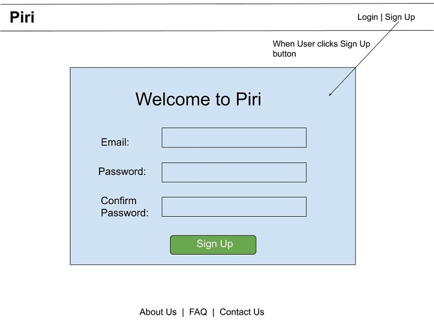
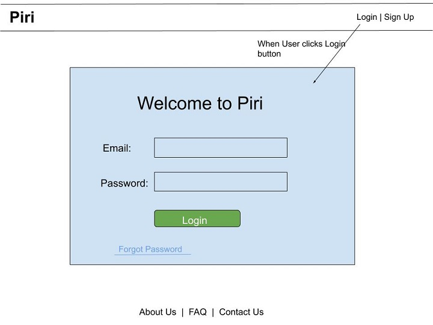
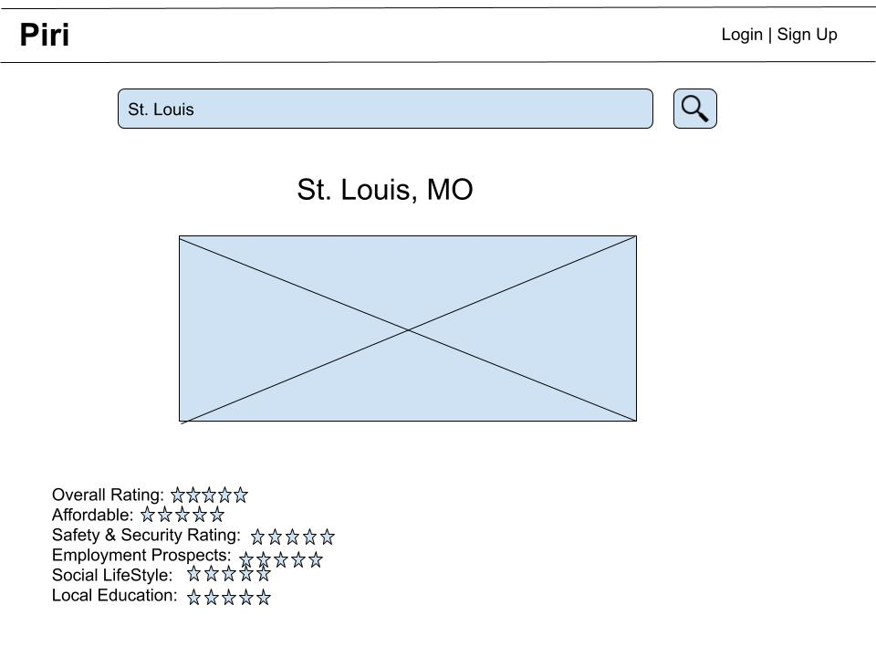

# Project Planning
For this assignment, you'll create some initial plans for your project.

## Assignment Description
[Project Planning Assignment](https://education.launchcode.org/liftoff/modules/assignments/project-planning)

### Wireframes

* **Home Page**

* **SignUp Page**

* **Log In Page**

* **City Page**

### Project Tracker

[Trello Board](https://trello.com/b/rdzXKTzs/liftoff-capstone-project)

### Project Repo Link

[Project GitHub](https://github.com/milan-shrestha/Piri)
